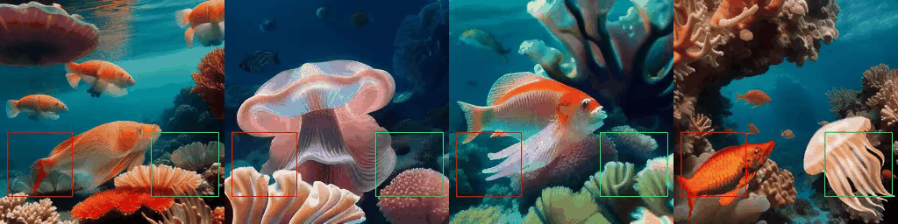

<p align="center">
  
</p>
<div align="center">

## LayerT2V: Interactive Multi-Object Trajectory Layering for Video Generation

[](https://kr-panghu.github.io/LayerT2V/assets/pdf/LayerT2V.pdf) &ensp; [](https://arxiv.org/abs/2508.04228) &ensp; [](https://kr-panghu.github.io/LayerT2V/)

</div>

<p align="center">
<span class="author-block">
  <a href="https://kr-panghu.github.io/">Kangrui Cen</a>&nbsp&nbsp</span>
<span class="author-block">
  <a href="https://scholar.google.com/citations?user=i46wdAUAAAAJ&hl=zh-CN">Baixuan Zhao</a>&nbsp&nbsp</span>
<span class="author-block">
  <a href="https://synbol.github.io/">Yi Xin</a>&nbsp&nbsp</span>
<span class="author-block">
  <a href="https://scholar.google.com/citations?hl=en&user=_Cwn43wAAAAJ">Siqi Luo</a>&nbsp&nbsp</span>
<span class="author-block">
  <a href="https://scholar.google.com/citations?user=E6zbSYgAAAAJ&hl=en">Guangtao Zhai</a>&nbsp&nbsp</span>
<span class="author-block">
  <a href="https://jhc.sjtu.edu.cn/~xiaohongliu/">Xiaohong Liu</a>&nbsp&nbsp</span>
</p>


> ✨ We introduce LayerT2V, the first approach<sup>#</sup>  for generating video by compositing background and foreground objects layer by layer. This layered generation enables flexible integration of multiple independent elements within a video, positioning each element on a distinct "layer" and thus facilitating coherent multi-object synthesis while enhancing control over the generation process. Extensive experiments demonstrate the superiority of LayerT2V in generating complex multi-object scenarios, showcasing 1.4x and 4.5x improvements in mIoU and AP50 metrics over state-of-the-art (SOTA) methods.
>
> <sup>#</sup>Concurrent work: [LayerFlow](https://github.com/SihuiJi/LayerFlow).
> 
> 📧 Contact us: kangruicen@gmail.com or xiaohongliu@sjtu.edu.cn


## Demo

Comparisons with other methods:

* The bounding box on the video shows the input trajectory, our method demonstrates the best bbox-alignment and also prompt-alignment.
* Since our method generates videos in a layer-to-layer manner, visual quality of generated results are guaranteed.

<table>
  <tr>
    <td>
      
      <p align="center">A deer and a horse running on the grassland.</p>
    </td>
  </tr>
  <tr>
    <td>
      
      <p align="center">A duck and a stone floating in the pond of a park.</p>
    </td>
  </tr>
  <tr>
    <td>
      
      <p align="center">A corgi and a robot running on the beach.</p>
    </td>
  </tr>
  <tr>
    <td>
      
      <p align="center">Two geese swimming in the lake.</p>
    </td>
  </tr>
  <tr>
    <td>
      
      <p align="center">A deer and a bear running on the grassland with a cabin in the distance.</p>
    </td>
  </tr>
  <tr>
    <td>
      
      <p align="center">A jellyfish and a carp in the ocean.</p>
    </td>
  </tr>
</table>


## Installation & Inference

<p>Codes will be organized shortly before submission ... Stay tuned! 🔥</p>


## Citation <a name="cite"></a>
```
@misc{cen2025layert2vinteractivemultiobjecttrajectory,
      title={LayerT2V: Interactive Multi-Object Trajectory Layering for Video Generation}, 
      author={Kangrui Cen and Baixuan Zhao and Yi Xin and Siqi Luo and Guangtao Zhai and Xiaohong Liu},
      year={2025},
      eprint={2508.04228},
      archivePrefix={arXiv},
      primaryClass={cs.CV},
      url={https://arxiv.org/abs/2508.04228}, 
}
```